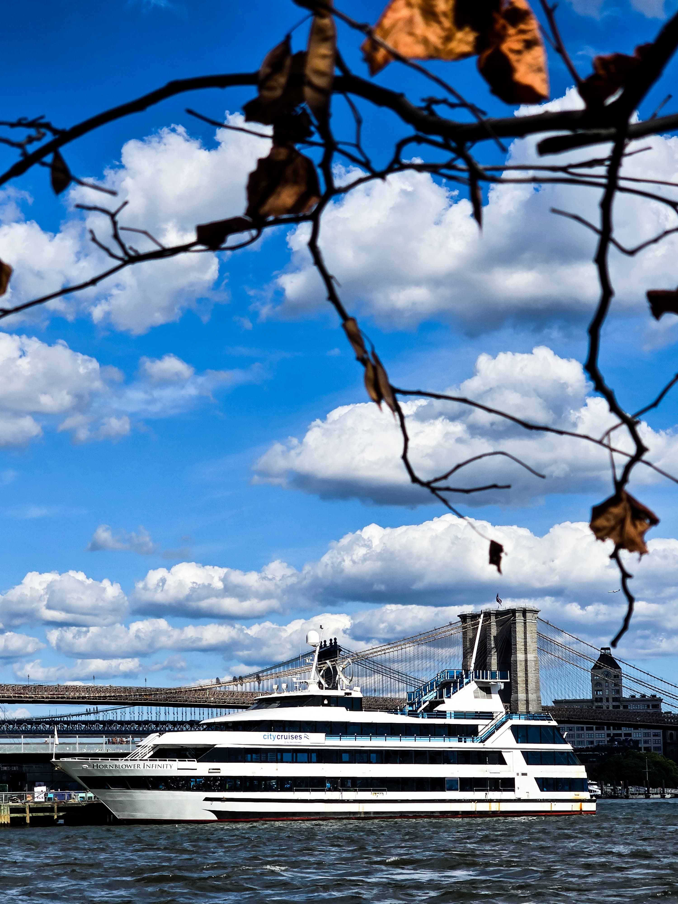
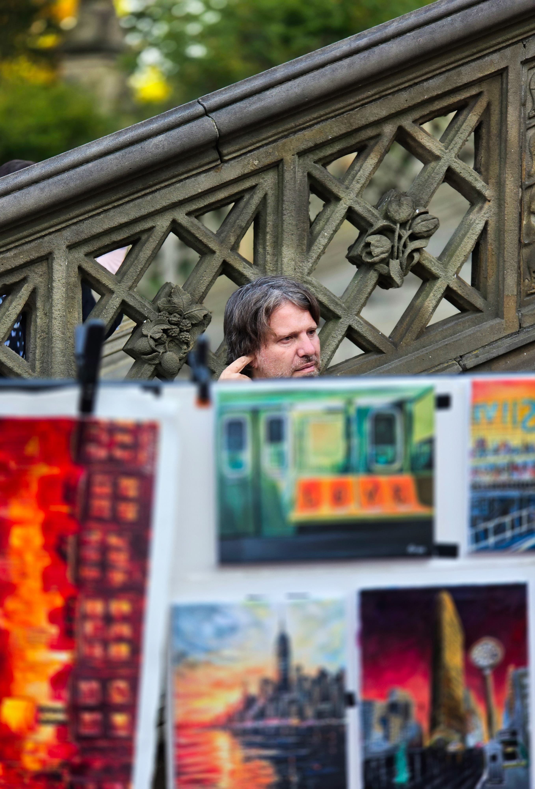
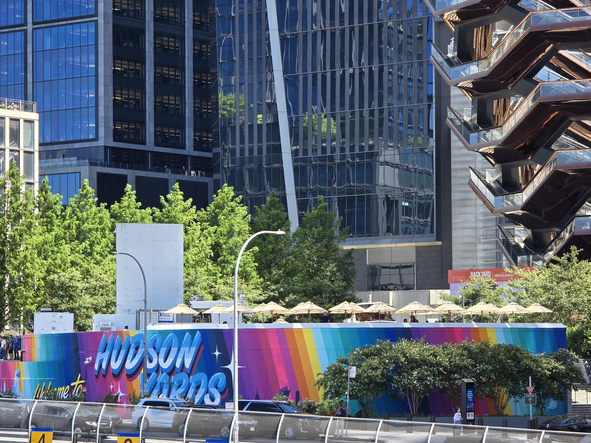
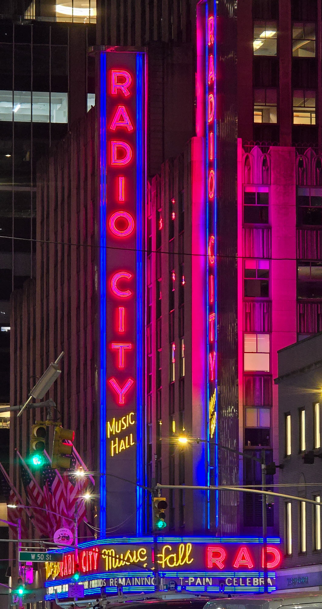
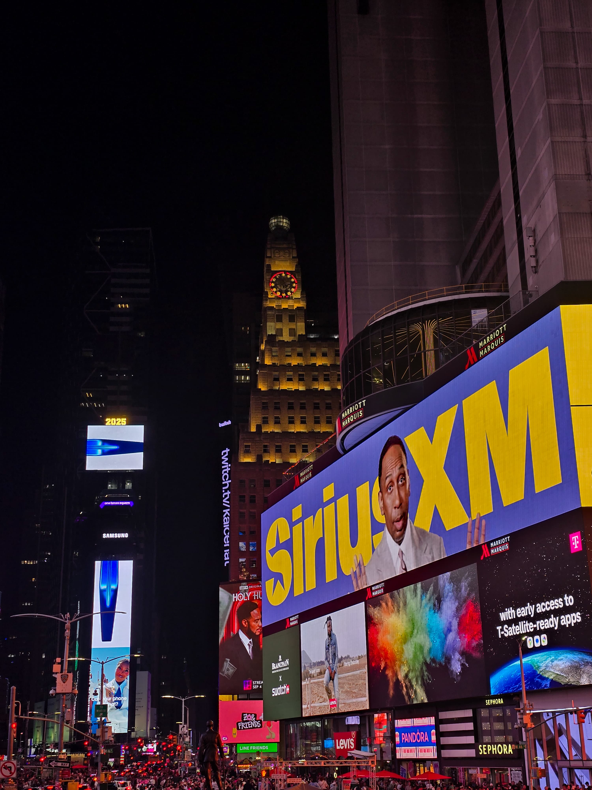
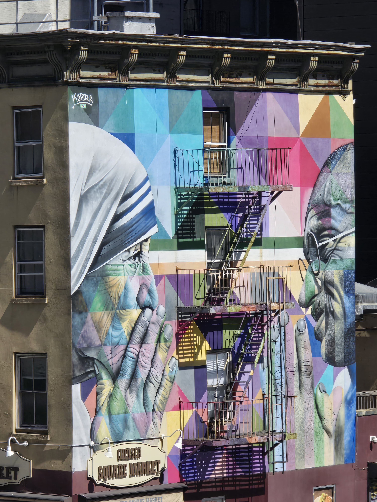
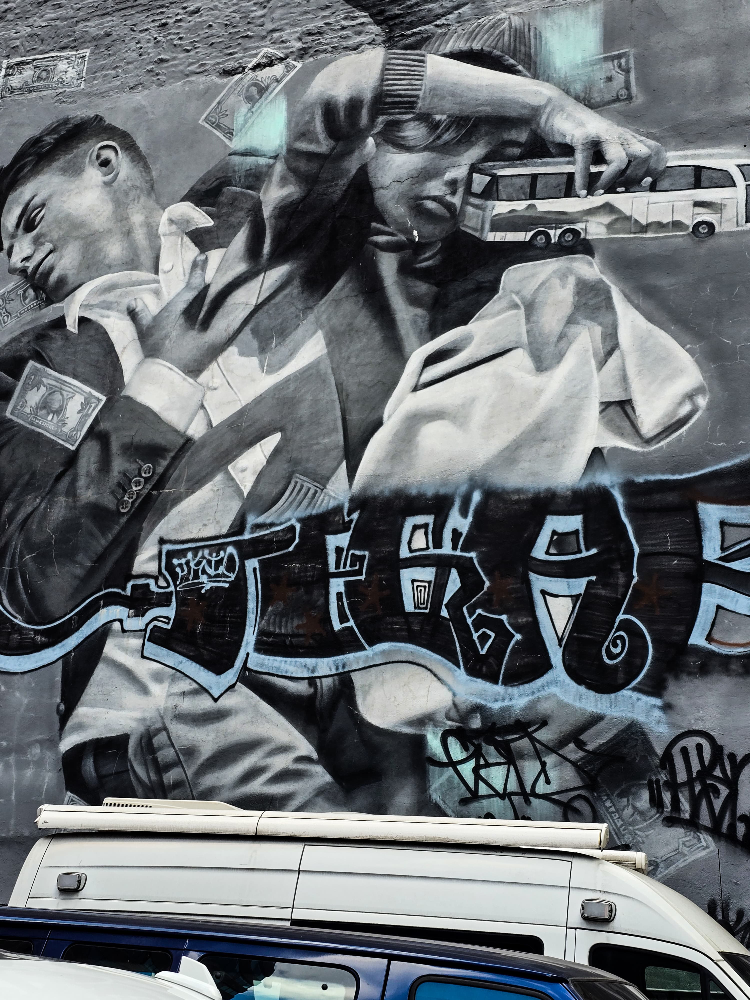
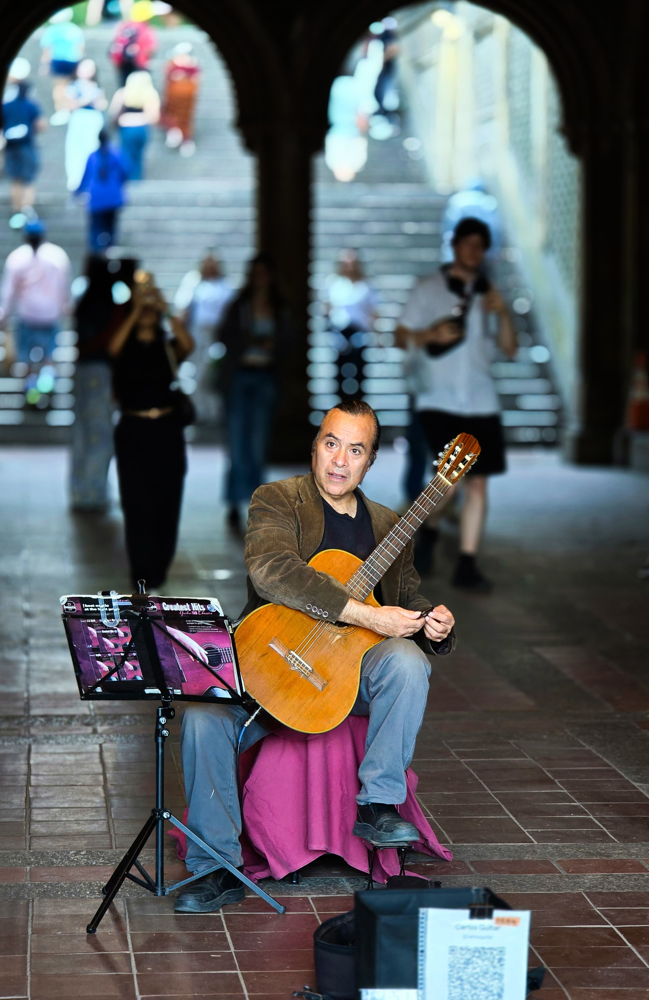
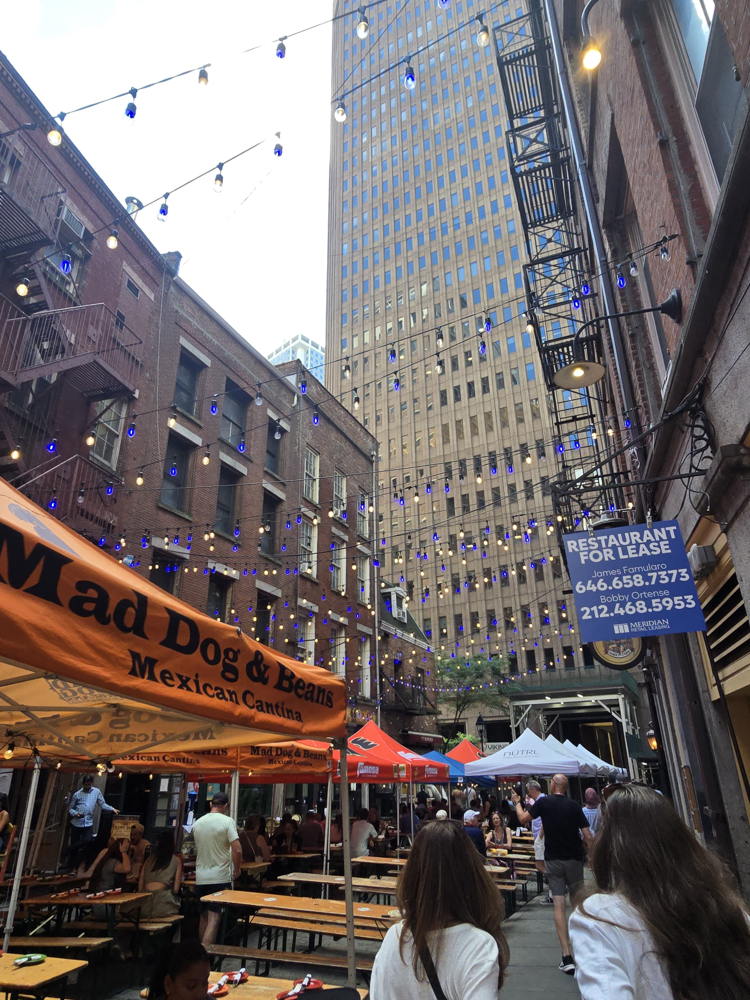

# My Travel Diary: New York City 

## Hey There!  
So… I finally made it to New York City!  
It’s loud, busy, colorful, and somehow peaceful all at the same time.  
Instead of just writing a boring essay, I wanted to make this repo feel like flipping through my travel journal.  
Here’s a peek at what I saw, ate, and loved.  

### Why I Can’t Get Enough of Traveling  
- Every city has its own rhythm.  
- Meeting strangers (and sometimes making friends).  
- Trying food I can’t pronounce but end up loving anyway.  
- Taking way too many pictures, because memories fade but photos stay.  

---

## My NYC Highlights (with Proof )  

- **Brooklyn Bridge Vibes**: The view was insane—boats, water, skyline, and me trying not to trip while taking pictures.  

  

- **Central Park Moments**: Street performers everywhere. Saw a guy painting the subway on canvas—NYC energy in a nutshell.  
  

- **Hudson Yards Color Explosion**: Art, murals, shiny glass buildings… it’s like the future but with rainbow walls.  
  

- **NYC After Dark**: Radio City glowing neon and Times Square being, well, Times Square. Crowded but magical.  
  
  

- **Street Art Madness**: The walls here talk. Seriously. Murals everywhere—some fun, some powerful.  
  
  

- **Music in the Air**: I stumbled into this guitarist in Central Park. He wasn’t famous, but the music made the moment unforgettable.  
  

- **Food & Street Vibes**: Picture this—fairy lights, long wooden tables, tacos in one hand, pizza slice in the other. NYC food streets are basically a party.  
  
  

---

## My Totally Unofficial NYC Travel Tips 
1. Don’t plan everything—leave room for surprises.  
2. Shoes matter. Blisters will ruin your day.  
3. Skip some tourist traps and eat where locals eat.  
4. Photos are cool, but don’t forget to just stand still and *look around*.  
5. Bring extra snacks. Always.  

---

## What NYC Taught Me  
- Chaos can be beautiful.  
- Art isn’t just in museums—it’s on walls, in parks, and in people.  
- Food tastes better when you share it outdoors with strangers.  
- Travel isn’t just about the places—it’s about how they make you *feel*.  

---

## Want to Explore NYC Too? Check These Out  
- [Time Out New York](https://www.timeout.com/newyork) (events, food, random cool stuff)  
- [Lonely Planet: New York](https://www.lonelyplanet.com/usa/new-york-city) (classic travel guide)  
- [Tripadvisor NYC](https://www.tripadvisor.com/Attractions-g60763-Activities-New_York_City_New_York.html) (when you want ALL the lists)  
